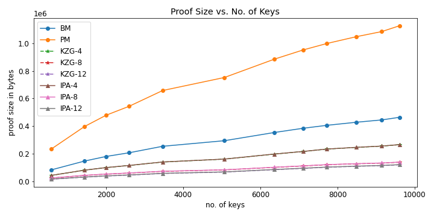
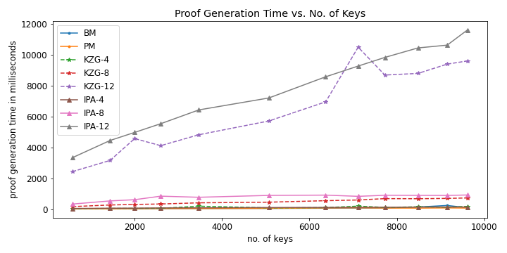
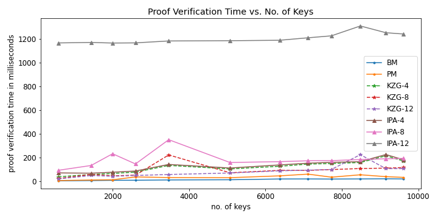

# Verkle Trees
This is the accompanying code for our research project for Cryptocurrencies & Distributed Ledgers Fall-22 Course. 

## Introduction
We implement Verkle, Patricia-Merkle, and Binary-Merkle in C++. We compare the proof sizes, proof generation time, and proof verification time for varying key sizes for all the three trees. 

We also compare two vector commitment schemes KZG and IPA in our Verkle Trees. For each of them, we compare multiple width versions of them. 

## Results




## Authors
- Pranav Jangir [pj2251@nyu.edu]
- Animesh Ramesh [ar8006@nyu.edu]
- Arun Patro [akp7833@nyu.edu]

[](https://forthebadge.com)

Verkle tree implementation in C++.

## Dependencies

- [blst library](https://github.com/supranational/blst) - For elliptic curve operations. (Static library included : libblst.a)
- [c-kzg library](https://github.com/benjaminion/c-kzg) - Uses blst library, defines useful utility functions like pippenger linear combination, FFT, field arithmetic etc. (Static library included : libckzg.a)
- [GNU MP library](https://gmplib.org) - For big integer support in C/C++.

## How to build

```
g++ simulator.cpp verkle.cpp libblst.a libckzg.a -o name
```

## File Descriptions

- `verkle.h` - Defines class VerkleTree with adjustable width (constant `WIDTH`). Supports 4 modes : KZG / IPA / Patricia Merkle / Binary Merkle.
- `simulator.cpp` - Parses json file containing data scraped from Etherscan API, and runs experiments using `verkle.h`
- `blst.h` - Defines APIs for curve operations.
- `c-kzg` - Utility functions.
